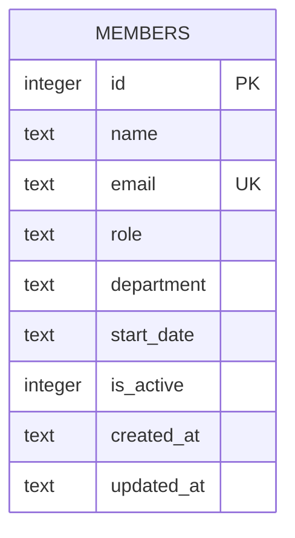

Single-table schema, created inline in `getDb()` (`server/src/db.ts:18-30`) — there is no migrations directory; schema changes mean editing the `CREATE TABLE IF NOT EXISTS` statement directly, which only applies to newly-created databases (existing `data/team.db` files won't pick up column changes without a manual migration).

- `email` has a `UNIQUE` constraint; `POST /api/members` catches the resulting SQLite error by matching `err.message.includes('UNIQUE')` and returns `409` (`server/src/routes/members.ts:40`) — there's no upfront existence check, so this string-matching catch is the only thing preventing a raw 500 on duplicate email.
- `is_active` defaults to `1` and is read by `GET /`, `/stats`, but never written to `0` anywhere in the codebase — see [[gotchas]] for why DELETE doesn't use it.
- `department` is an unconstrained `TEXT` column — no enum, no FK to a departments table, no validation. See [[gotchas]] for the CI implication.
