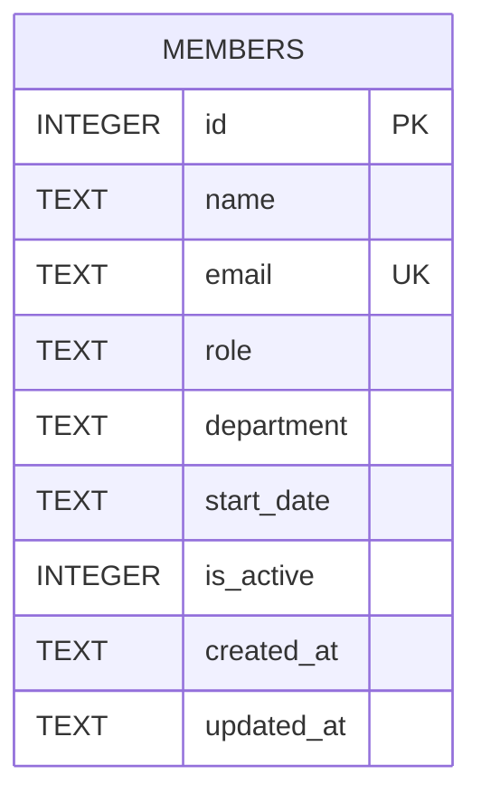

The schema is defined inline in `getDb()` via `CREATE TABLE IF NOT EXISTS` — there are no migration files or a `schema.prisma`; `server/src/db.ts` is the single source of truth for the schema.

- `email` has a `UNIQUE` constraint; `routes/members.ts` catches the resulting SQLite error by string-matching `err.message.includes('UNIQUE')` and turns it into a 409 — there's no pre-check query.
- `department` is a free-text column with no `CHECK` constraint, enum, or foreign-key lookup table. Nothing in the schema restricts it to a fixed set of values (see [[gotchas]] for why this matters right now).
- `is_active` defaults to `1` and is used to filter `GET /api/members` and `GET /api/members/stats`, but nothing in the current code ever sets it to `0` — see [[gotchas]] for the DELETE behavior that bypasses it entirely.
