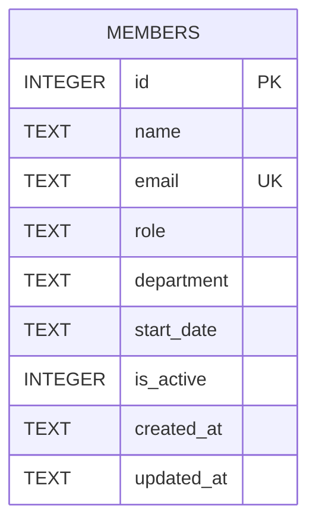

Single-table schema, created in `getDb()` (`server/src/db.ts:18`):

## `is_active` is not wired to a soft delete

The column name and `GET /api/members`'s `WHERE is_active = 1` filter (`server/src/routes/members.ts:21`) imply a soft-delete pattern, but no code path ever sets `is_active = 0`. `DELETE /api/members/:id` (`server/src/routes/members.ts:106-117`) issues `DELETE FROM members WHERE id = ?` — a **hard delete**. If a feature needs "deactivate without erasing," it doesn't exist yet; `is_active` currently only ever holds its seed/insert default of `1`.

`PATCH /api/members/:id` (`server/src/routes/members.ts:83-104`) updates `name`, `email`, `role`, `department` via `COALESCE(?, column)` — passing `undefined` for a field leaves it unchanged. `start_date` and `is_active` are not patchable through this route.
